# Moc Jobs

This is a backend executor jobs. Periodic tasks that runs differents jobs, 
that call the contracts and asks if the are ready to execute it. This jobs 
run async of the app, and call directly to the contract througth node. 

### Currents jobs

 1. Contract liquidation
 2. Contract bucket liquidation
 3. Contract run settlement
 4. Contract daily inrate payment
 5. Contract pay bitpro holders
 6. Contract calculate EMA
 7. Oracle Compute: Check expiration of price in Oracle.
 
 
### Usage

**Requirement and installation**
 
*  We need Python 3.6+

Install libraries

`pip install -r requirements.txt`

**Usage Job**

Make sure to change **config.json** to point to your network.

`python moc_jobs.py`

Alternatives:

`python moc_jobs.py --network=mocTestnetAlpha`

**--config:** Path to config.json 

**--network=local:** Network name in the json


**Usage Docker**

Build

```
docker build -t moc_jobs -f Dockerfile .
```

Run

```
docker run -d \
--name moc_jobs_1 \
--env ACCOUNT_PK_SECRET=0x9e790b185e5b7f11f2924c7b809936866c38ed3ab3f33e0fbd3cfe791c2cdbd6 \
--env MOC_JOBS_NETWORK=mocTestnetAlpha \
moc_jobs
```
  
 
### Jobs explain

Some of this tasks you can run directly from the app in https://alpha.moneyonchain.com/advanced


# AWS


## Usage


### **Starting building server**

First you have to start the building server in EC2

Connect to builder with bastion

```
ssh -F /home/martin/.ssh/bastion/moc_ssh_config moc-builder
```

change user to builder

```
sudo su builder -s /bin/bash
```


### **Building image** 

```
./build.sh -e <environment>
```

 Where environment could be

* ec2_alphatestnet: alpha-testnet.moneyonchain.com
* ec2_testnet: moc-testnet.moneyonchain.com
* ec2_mainnet: alpha.moneyonchain.com
* ec2_rdoc_mainnet: rif.moneyonchain.com
* ec2_rdoc_testnet: rif-testnet.moneyonchain.com
* ec2_rdoc_alphatestnet: rif-alpha.moneyonchain.com


This command will take the ABIs (builds) from the version folder corresponding to the implementation.

Finally it will build the docker image.


### Pushing Image to repository

Before pushing the image, we need to check if ecr image exist, go to [https://us-west-1.console.aws.amazon.com/ecr/repositories?region=us-west-1](https://us-west-1.console.aws.amazon.com/ecr/repositories?region=us-west-1) and create it

Ensure you have installed the latest version of the AWS CLI and Docker.

Make sure you have built your image before pushing it. Then execute **./tag_and_push.sh -e  &lt;environment>**

This script will tag with _latest_ and push to the proper repository.

```
$ ./tag_and_push.sh -e moc-alphatestnet
```

Result 

```

WARNING! Using --password via the CLI is insecure. Use --password-stdin.
Login Succeeded
The push refers to repository [551471957915.dkr.ecr.us-west-1.amazonaws.com/moc_jobs_moc-alphatestnet]
1ec27b2766b2: Pushed 
45dbe5a18fd6: Pushed 
4d4bec2e685f: Pushed 
9da1af2983d7: Pushed 
b24985db57b9: Pushed 
d22eb95b7a94: Pushed 
bb1af9323ea6: Pushed 
48ea5aa9c3a2: Pushed 
c2dfe15f7892: Pushed 
013b3c7b17e1: Pushed 
8c40e5337dcd: Pushed 
978eb45ee4b6: Pushed 
3f53405f239c: Pushed 
48ebd1638acd: Pushed 
31f78d833a92: Pushed 
2ea751c0f96c: Pushed 
7a435d49206f: Pushed 
9674e3075904: Pushed 
831b66a484dc: Pushed 
latest: digest: sha256:131df4bd072586f2808143129d8d396dcf304f758771c46b3470ae474fbf0e37 size: 4306
```

Image should be now available in the AWS repository for Fargate usage

## Setting up AWS Jobs in AWS ECS

AWS Jobs are setup as services in AWS ECS. On the task definition it's important to set up the proper environment variables.


1. MOC_JOBS_CONFIG: The config.json you find in your _version/ENVIRONMENT_ folder as a flattened json
2. ACCOUNT_PK_SECRET: The Private Key of the account that the jobs use. You need to set this as **"valueFrom"** and store the PK in AWS System Manager as an **encrypted parameter**
3. MOC_JOBS_NAME: The name of the environment where you are deploying (moc-alphatestnet, moc-testnet, rrc20-testnet)
4. AWS_ACCESS_KEY_ID and AWS_SECRET_ACCESS_KEY: these are needed for the heartbeat function of the jobs, as it needs an account that has write access to a metric in Cloudwatch
5. MOC_JOBS_NETWORK: The network here is listed in MOC_JOBS_CONFIG

**Note Important:** Take a look to folder **enviroments**. Tasks Definitions.

### Below are the all the steps necessary, from creating the task until the service is created


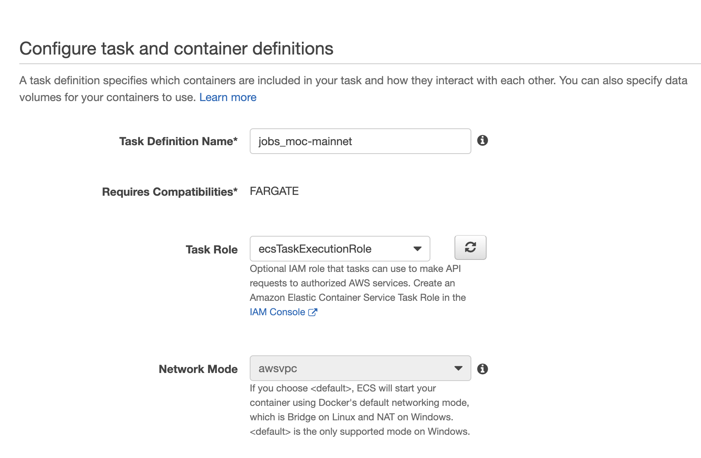
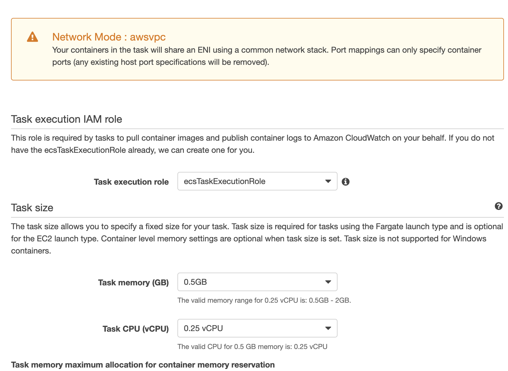
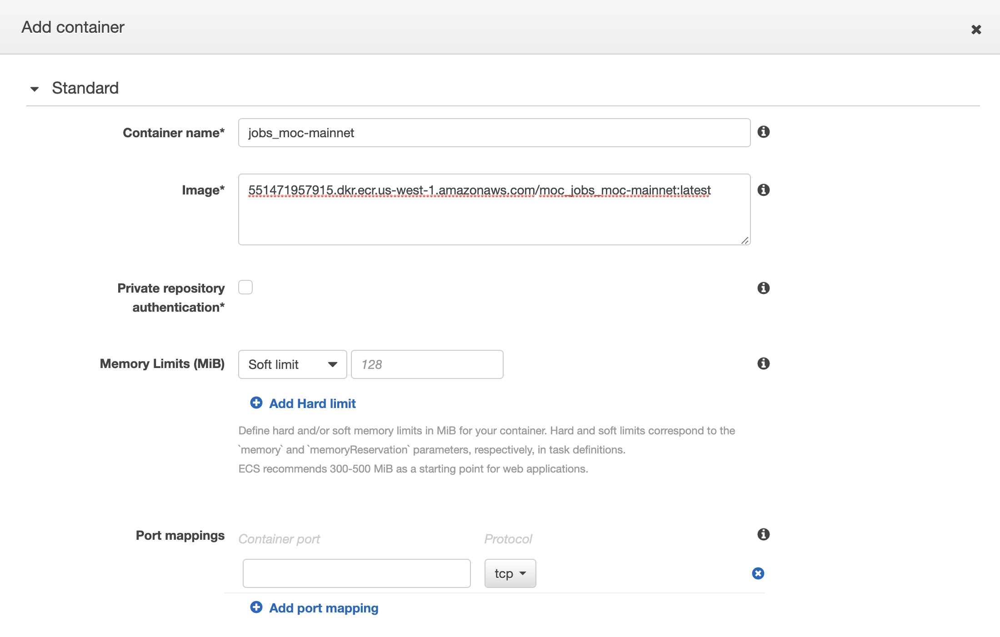
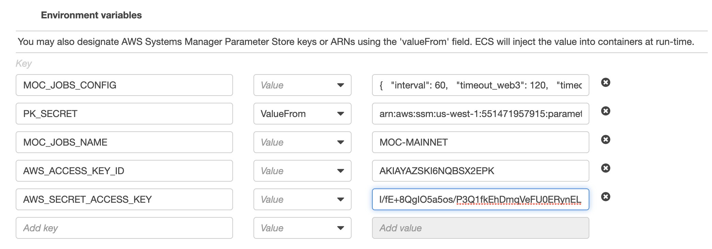
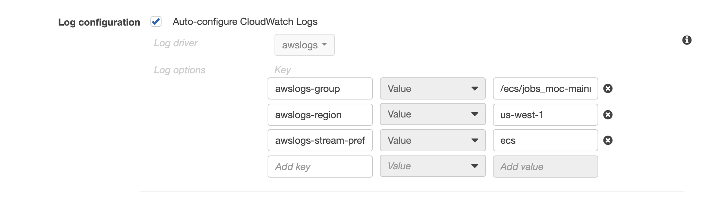
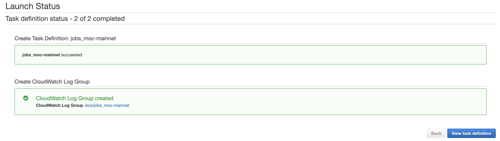

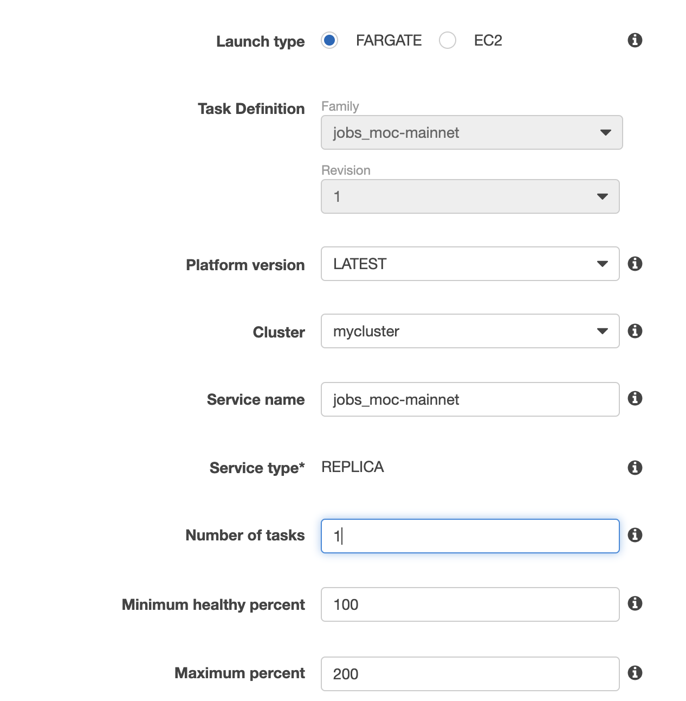
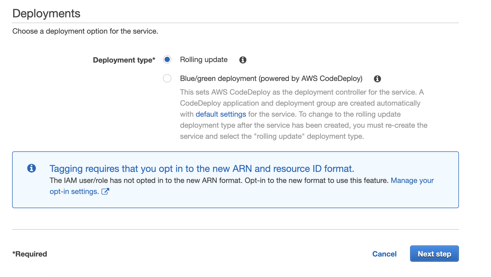
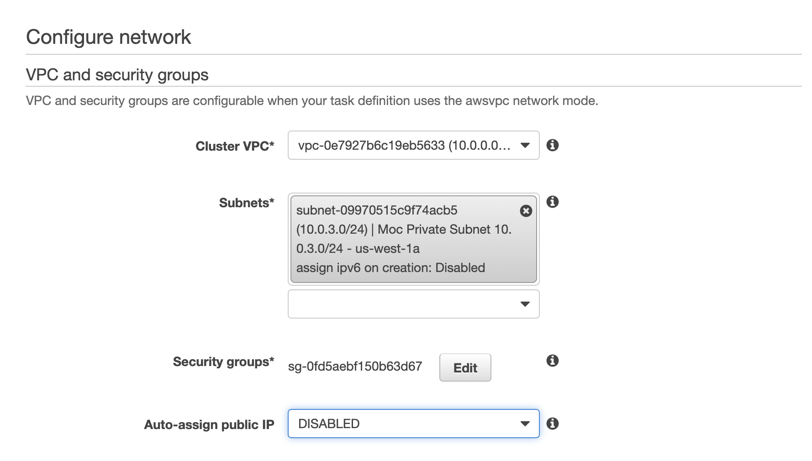
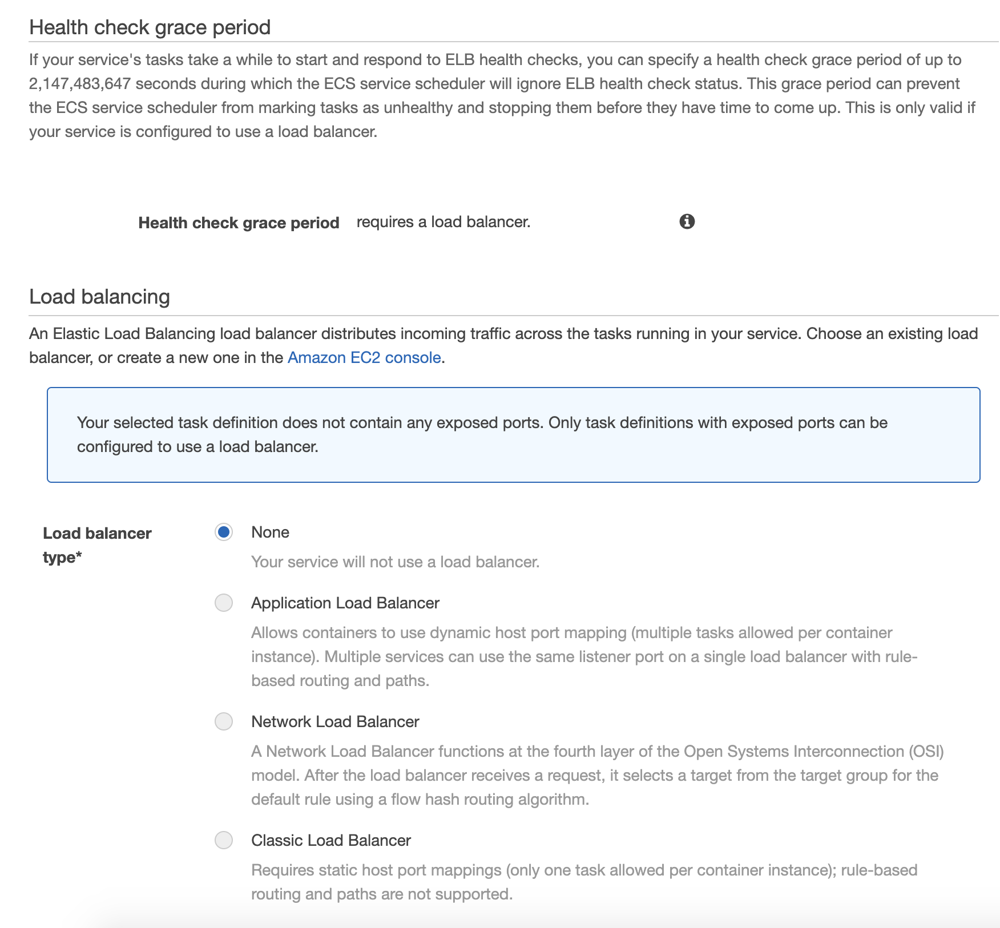
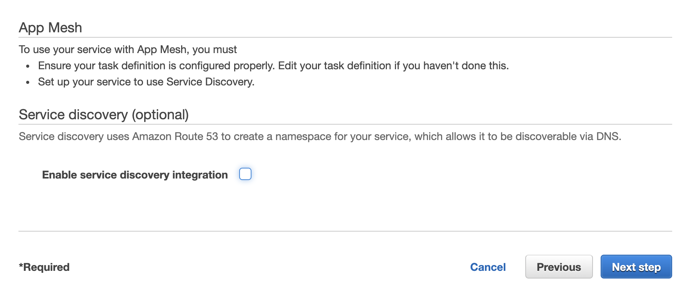
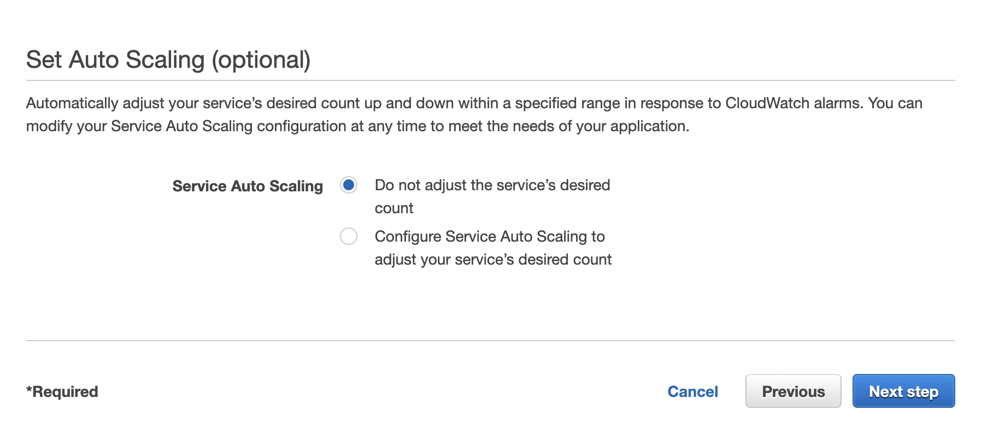

**Check that the service is in RUNNING state and check the logs tab to validate it's working fine**

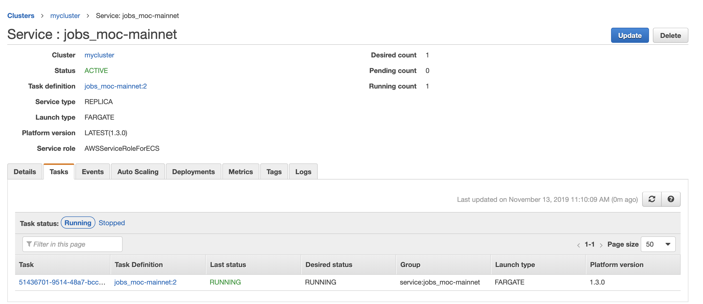