# AWS Moc Jobs

## About

Script for creating the docker image for AWS Fargate usage. These jobs were originally part of the MocExecutor part of the Meteor app but extracted to avoid nonce issues (too low/too high)
It has an integration with AWS Cloudwatch to check the logs and also **the private key is taken from environment variables**

## Usage

### **Building image** 
```
build.sh -e <environment>
```

 Where environment could be

* test: test.moneyonchain.com
* moc-testnet: moc-testnet.moneyonchain.com
* moc-mainnet: moc-mainnet.moneyonchain.com
* rrc20-mainnet: nuecwj.moneyonchain.com

_(Feel free to add new implementations here)_


This command will take the ABIs from the version folder corresponding to the implementation.

Finally it will build the docker image.

### **Running image**

In case you want to validate if the image is working as expected you can run the following command

```
docker run  -v ${PWD}/logs:/home/www-data/app/price_feeder/logs <image of your choosing>
```

## Pushing images to AWS Elastic Container Repository (ECR)

Ensure you have installed the latest version of the AWS CLI and Docker.

Make sure you have built your image before pushing it. Then execute **tag_and_push.sh -e  &lt;environment>**

This script will tag with _latest_ and push to the proper repository.

```
Leonels-MacBook-Pro:aws_jobs leonelcorso$ ./tag_and_push.sh -e moc-mainnet
WARNING! Using --password via the CLI is insecure. Use --password-stdin.
Login Succeeded
The push refers to repository [551471957915.dkr.ecr.us-west-1.amazonaws.com/moc_jobs_moc-mainnet]
1ec27b2766b2: Pushed 
45dbe5a18fd6: Pushed 
4d4bec2e685f: Pushed 
9da1af2983d7: Pushed 
b24985db57b9: Pushed 
d22eb95b7a94: Pushed 
bb1af9323ea6: Pushed 
48ea5aa9c3a2: Pushed 
c2dfe15f7892: Pushed 
013b3c7b17e1: Pushed 
8c40e5337dcd: Pushed 
978eb45ee4b6: Pushed 
3f53405f239c: Pushed 
48ebd1638acd: Pushed 
31f78d833a92: Pushed 
2ea751c0f96c: Pushed 
7a435d49206f: Pushed 
9674e3075904: Pushed 
831b66a484dc: Pushed 
latest: digest: sha256:131df4bd072586f2808143129d8d396dcf304f758771c46b3470ae474fbf0e37 size: 4306
```

Image should be now available in the AWS repository for Fargate usage

## Setting up AWS Jobs in AWS ECS

AWS Jobs are setup as services in AWS ECS. On the task definition it's important to set up the proper environment variables.


1. MOC_JOBS_CONFIG: The config.json you find in your _version/ENVIRONMENT_ folder as a flattened json
1. PK_SECRET: The Private Key of the account that the jobs use. You need to set this as **"valueFrom"** and store the PK in AWS System Manager as an **encrypted parameter**
1. MOC_JOBS_NAME: The name of the environment where you are deploying (test, moc-testnet, rrc20-testnet)
1. AWS_ACCESS_KEY_ID and AWS_SECRET_ACCESS_KEY: these are needed for the heartbeat function of the jobs, as it needs an account that has write access to a metric in Cloudwatch

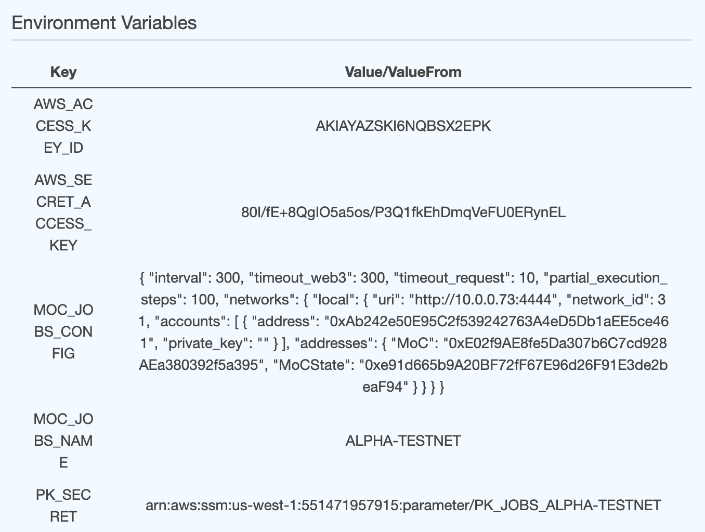


### Below are the all the steps necessary, from creating the task until the service is created


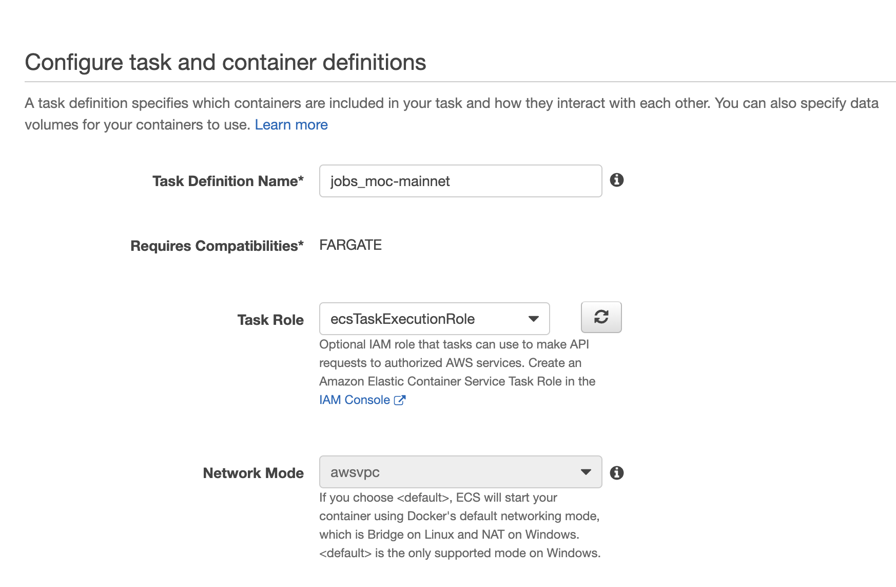
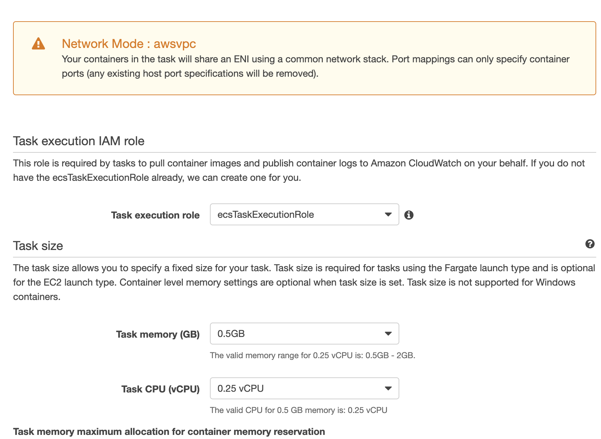
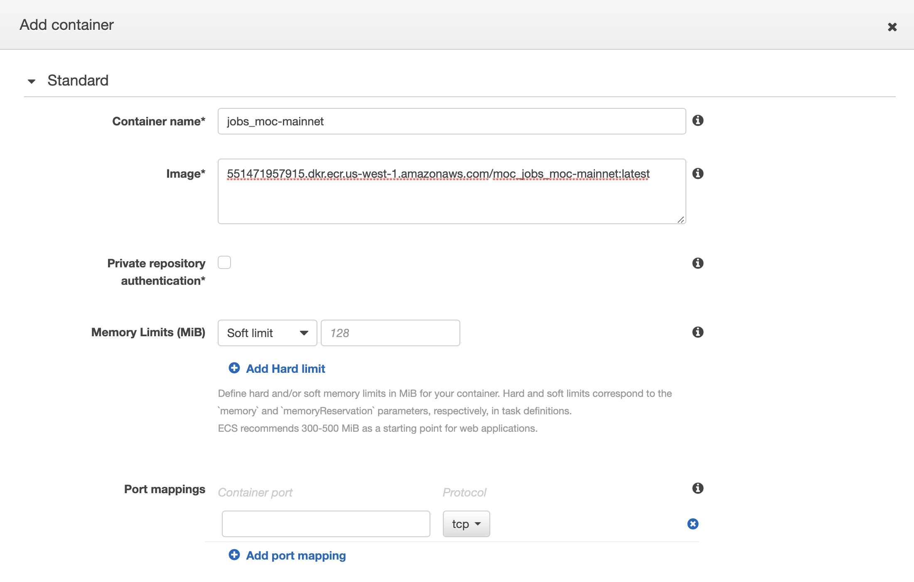
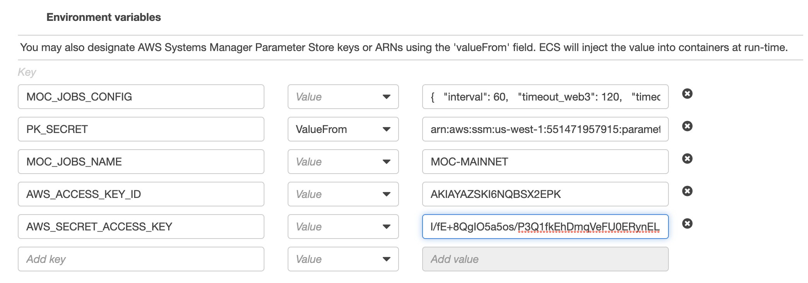
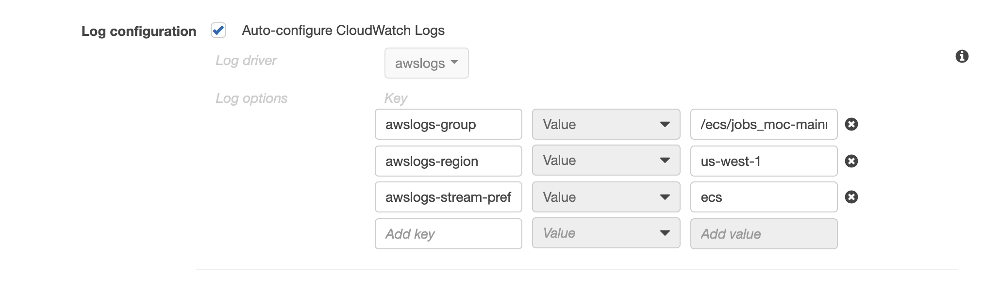
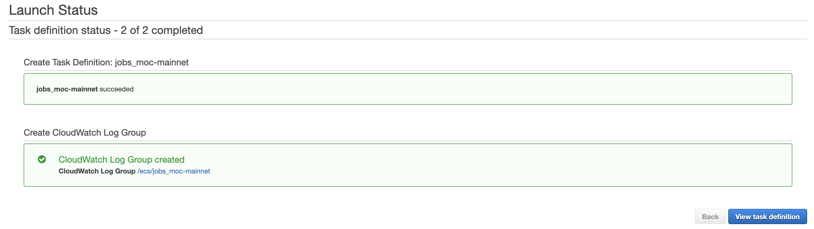
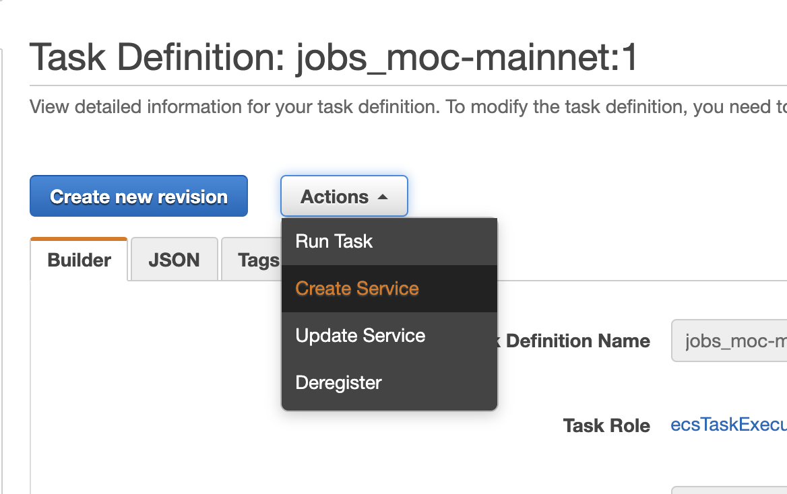
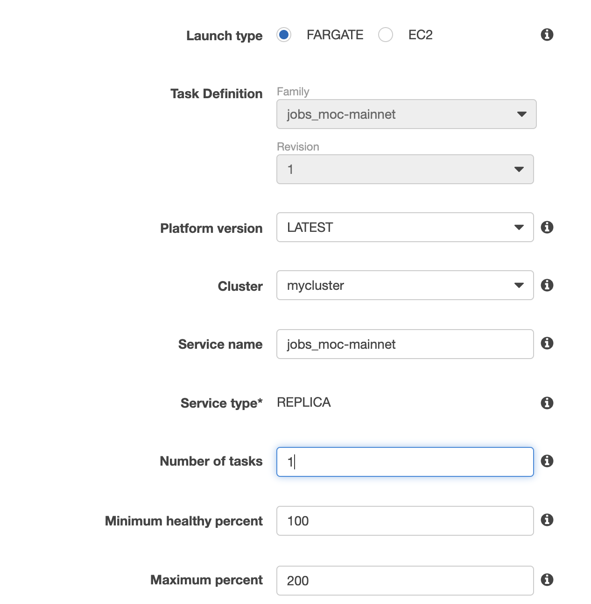
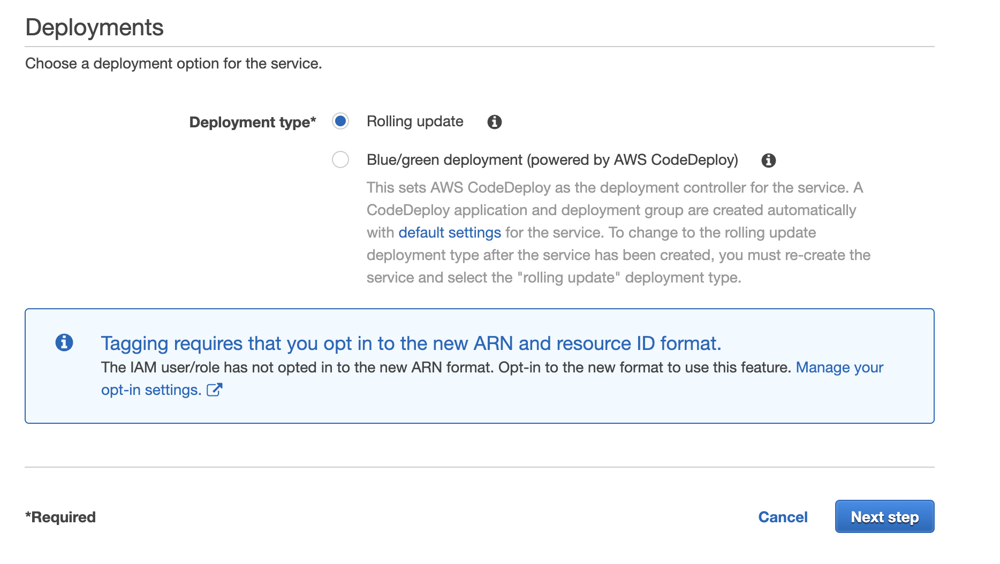
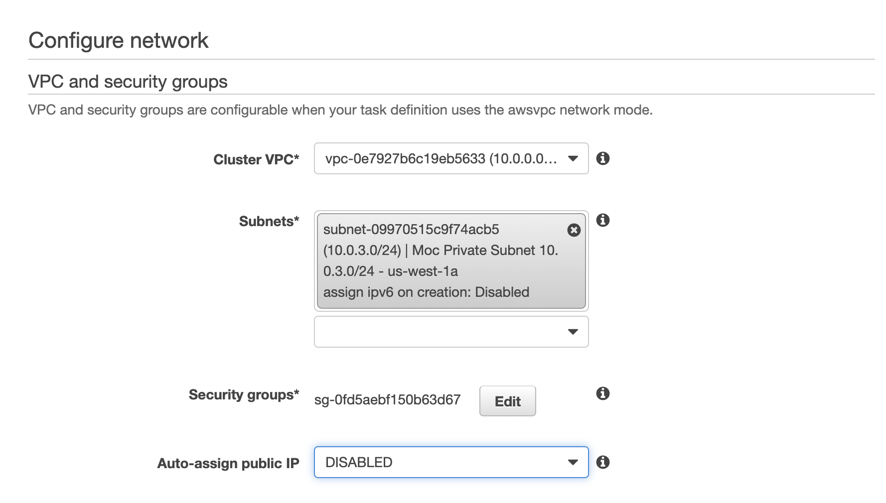
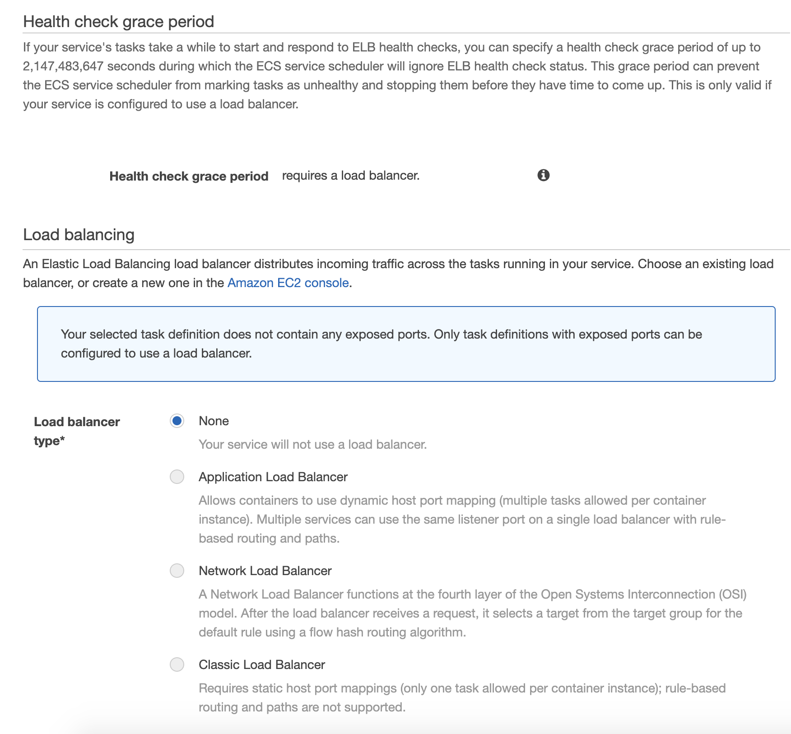
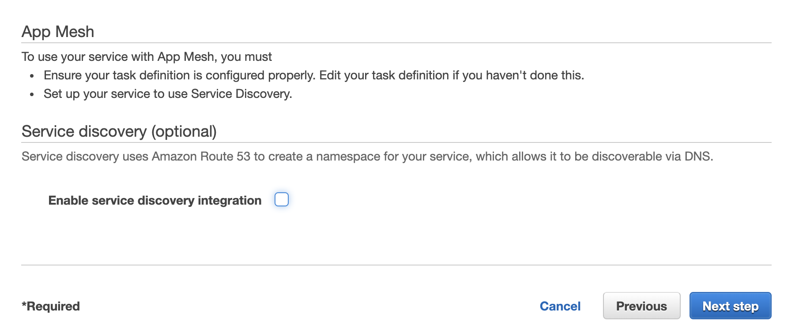
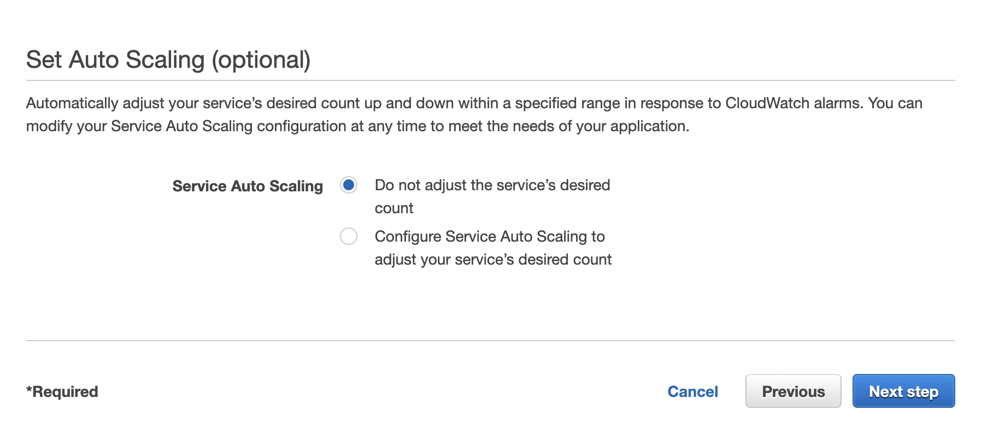

**Check that the service is in RUNNING state and check the logs tab to validate it's working fine**

